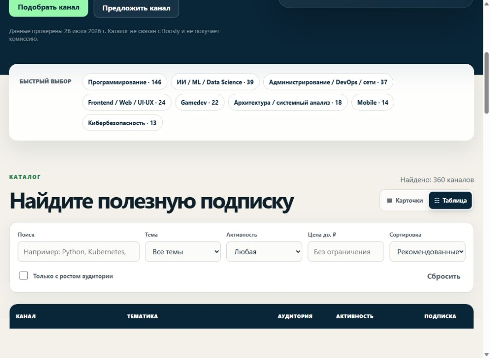
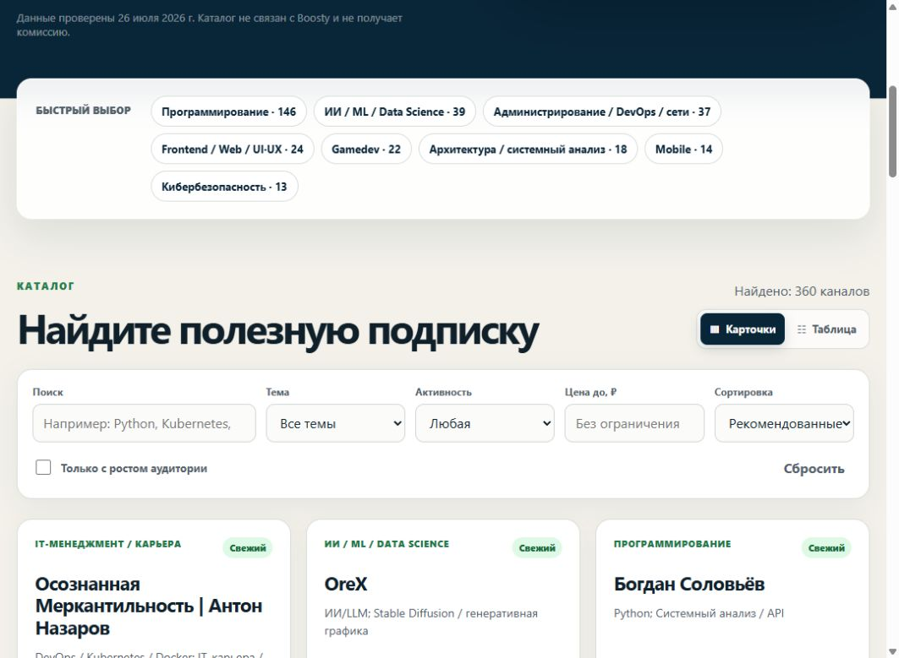

# Boosty IT Каталог

[](https://github.com/BelyaevAD/boosty-it-catalog/actions/workflows/ci.yml)
[](https://github.com/BelyaevAD/boosty-it-catalog/actions/workflows/pages.yml)
[](LICENSE)

**Сайт:** [belyaevad.github.io/boosty-it-catalog](https://belyaevad.github.io/boosty-it-catalog/)

Открытый каталог русскоязычных IT-каналов с платной подпиской на Boosty. В нём собраны авторы об ИИ, программировании, архитектуре, системном администрировании, DevOps, self-hosting, информационной безопасности, данных, QA, мобильной разработке, gamedev, 1С и IT-карьере.

Каталог регулярно растёт: актуальная проверенная выборка находится в
[`data/channels.json`](data/channels.json), а полный список найденных кандидатов — в
[`data/raw/boosty-candidates.json`](data/raw/boosty-candidates.json). Данные обновляются
автоматически каждую неделю.

## Как выглядит каталог

### Сравнительная таблица

[](https://belyaevad.github.io/boosty-it-catalog/#catalog)

### Карточки

[](https://belyaevad.github.io/boosty-it-catalog/?view=cards#catalog)

### Расширенная карточка

[](https://belyaevad.github.io/boosty-it-catalog/?view=cards#catalog)

Нажмите на изображение, чтобы открыть соответствующий режим на сайте.

## Что умеет сайт

- ищет по названию, теме и технологиям;
- открывает компактную сравнительную таблицу по умолчанию и адаптирует её в вертикальный список на мобильных экранах;
- фильтрует по категории, активности, цене и росту аудитории;
- сортирует по свежести, аудитории, цене и названию;
- переключается между карточками и сравнительной таблицей с сортировкой по колонкам;
- открывает расширенные сведения и описание канала в модальном окне;
- даёт быстрый переход на Boosty прямо из карточки или рядом с названием в таблице;
- создаёт отдельную индексируемую страницу для каждого канала;
- публикует sitemap, RSS и структурированные данные Schema.org;
- работает как обычный статический сайт без трекеров, cookies и стороннего JavaScript.

## Данные

- [`data/channels.json`](data/channels.json) — очищенный каталог, который публикуется на сайте;
- [`data/raw/boosty-candidates.json`](data/raw/boosty-candidates.json) — полный список найденных кандидатов до тематической фильтрации;
- [`data/manual-exclusions.json`](data/manual-exclusions.json) — проверенные вручную ложные совпадения, которые остаются в исходной выборке, но не публикуются;
- [`data/history/`](data/history/) — датированные снимки показателей;
- [`data/latest-update.json`](data/latest-update.json) — отчёт последнего автоматического обновления и состояние очереди повторной проверки.

На сайте намеренно не публикуются собранные внешние ссылки авторов, поисковые запросы и внутренняя методика исследования.
Публичные описания автоматически очищаются от явных e-mail, телефонных и платёжных номеров,
мессенджер-ссылок, контактных `@handle` и прямых инструкций связаться. Имена авторов и названия
брендов сохраняются.

## Обновление

GitHub Actions запускает проверку **каждую пятницу вечером**:

1. обновляет счётчики, активность и тарифы уже известных каналов;
2. ищет новые страницы в публичном каталоге и поиске Boosty, актуальном русскоязычном индексе Common Crawl, веб-поиске и открытом коде GitHub;
3. автоматически добавляет только русскоязычные страницы с платным уровнем, публикациями и высоким тематическим совпадением;
4. валидирует данные и сайт;
5. фиксирует изменения в `main`, после чего GitHub Pages публикует новую версию.

Обновление можно запустить вручную в Actions → **Weekly data refresh**.

## Локальный запуск

Нужен Node.js 20 или новее.

```bash
npm ci
npm run check
npx serve dist
```

Сайт будет собран в `dist/`. В проекте нет runtime-зависимостей; `npx serve` нужен только для удобного локального просмотра.

## Как добавить или исправить канал

Создайте issue по одному из шаблонов:

- **Предложить канал** — для новой русскоязычной IT-подписки;
- **Исправить данные** — для неверной категории, устаревшей или удалённой страницы.

Подробности для разработчиков находятся в [CONTRIBUTING.md](CONTRIBUTING.md).

## Ограничения

- каталог широкий, но не гарантирует математически полный охват Boosty;
- публичный счётчик подписчиков не обязательно равен числу платящих подписчиков;
- цена, состав уровней и доступность материалов могут измениться между проверками;
- каталог не оценивает качество материалов и не является рекламной рекомендацией;
- проект не связан с Boosty и не получает комиссию от подписок.

Код распространяется по [MIT License](LICENSE). Условия повторного использования набора данных описаны в [DATA_LICENSE.md](DATA_LICENSE.md).
